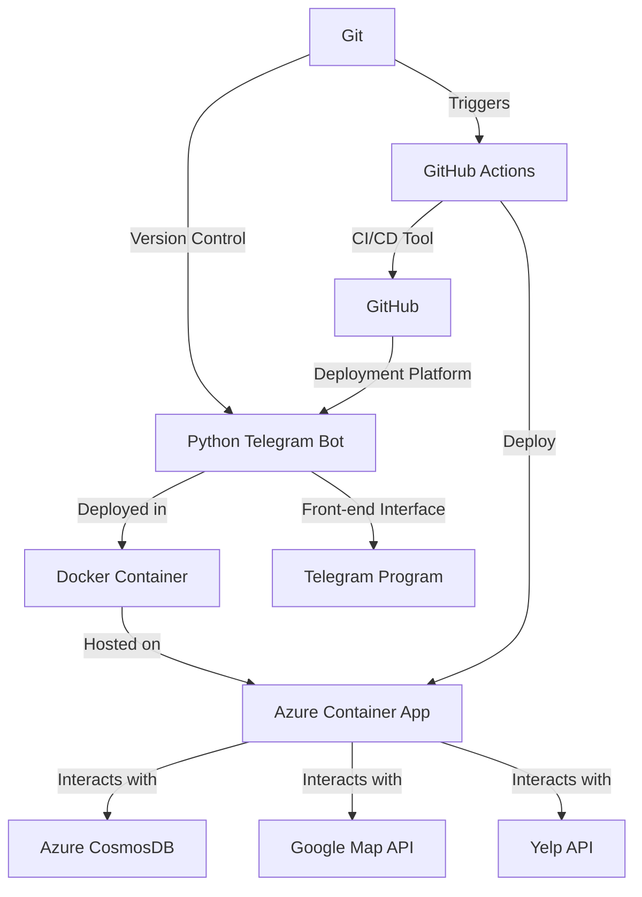

## Project structure

Our project uses python to build telegram bot, uses docker `container` as the basis, uses `azure container app` to deploy, uses cloud services such as `azure cosmosDB`, `google map`, `yelp api`, etc. to implement functions, uses the telegram program as the front-end interface, and uses `git` as version control. Use `github` as a deployment platform and `github action` as continuous deployment tool.

## Cloud service platform

### Azure cosmosDB

- Free for HKBU students
- Have `mongodb` API that is convenient for python program to use
- Use `mongodb compass` to easily manage data
- Store dialog records so that GPT can have continuous conversations

### Azure container app

- Free for HKBU students
- Use k8s as a container cluster management platform to automatically deploy, scale and manage containerized applications.
- Use github action as a continuous deployment tool
